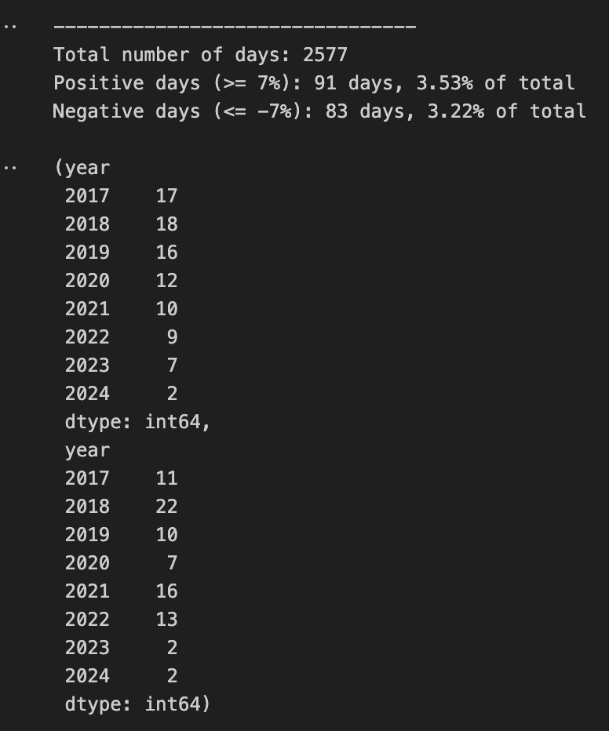
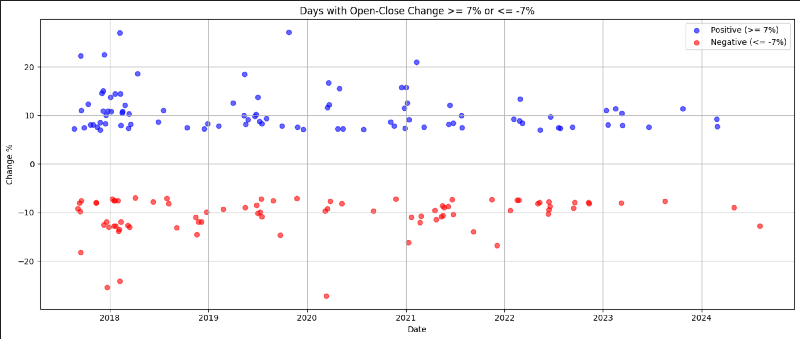

# BTC_OPTIONS
비트코인 옵션 매도 전략을 위한 데이터 분석

## 프로젝트 개요
이 프로젝트는 비트코인 옵션에서 만기가 24시간인 풋옵션과 콜옵션을 매도하는 전략을 위한 데이터 분석입니다. Deribit 플랫폼의 옵션 만기가 한국 시간 기준 오후 5시부터 익일 오후 5시까지라는 점을 고려하여, 과거 7년 동안의 비트코인 가격 변동 데이터를 분석할 수 있습니다.

## 데이터 수집
- 데이터 출처: 바이낸스 API
- 기간: 2017년부터 현재까지의 7년간 1시간 봉 데이터 수집
- 데이터 가공: 오후 5시부터 익일 오후 5시까지의 데이터를 합쳐 1일 봉 데이터 생성

## 분석 내용
- 변화율 계산: 시가와 종가 기준으로 변화율을 계산
- 시각화: 사용자가 입력한 변화율 변수 k에 따라, 과거 7년 동안 변화율 k를 초과한 순간과 그 횟수를 시각화하여 제공
- 리스크 평가: 예를 들어, 풋옵션 매도를 현재 가격의 7% 아래에서 했을 때, 과거 데이터 기반으로 행사가격 아래로 떨어질 리스크를 확인할 수 있는 분석 제공

  
  

## 활용 방안
- 이 분석은 트레이더들이 옵션 매도 전략을 세우는 데 유용하며, 과거 데이터 기반 특정 변화율 이상 상승 또는 하락 리스크를 사전 평가하는 데 도움을 줍니다. 이를 통해 보다 신중한 투자 결정을 내릴 수 있습니다.
